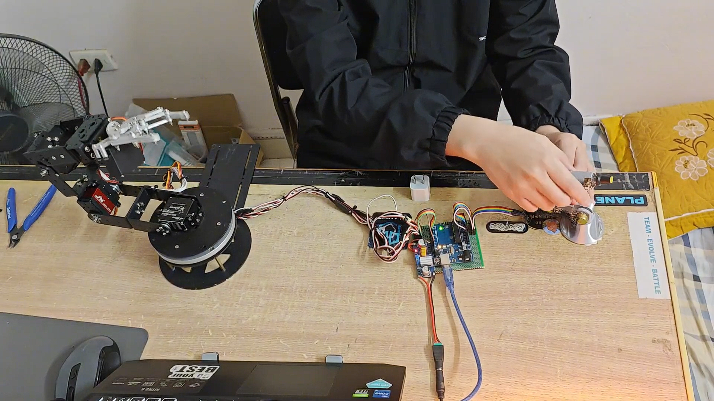
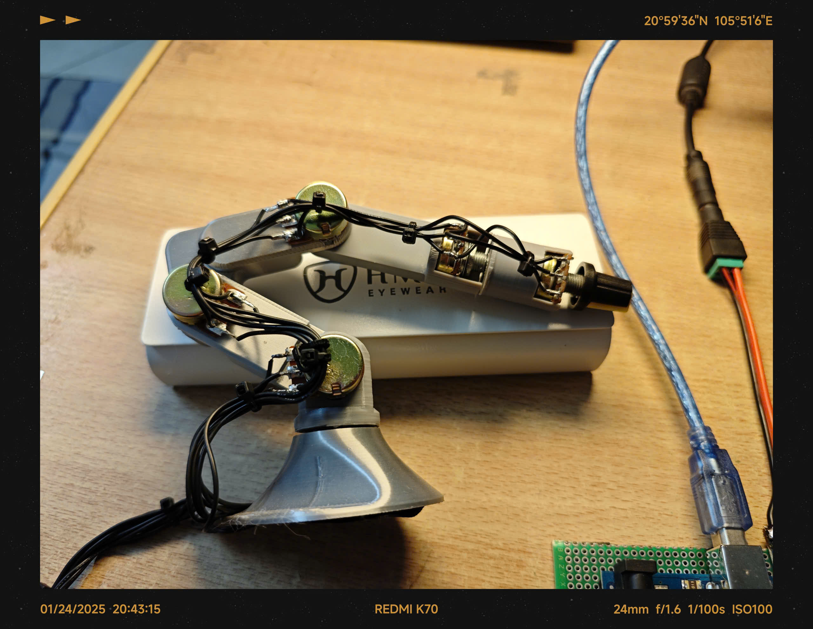
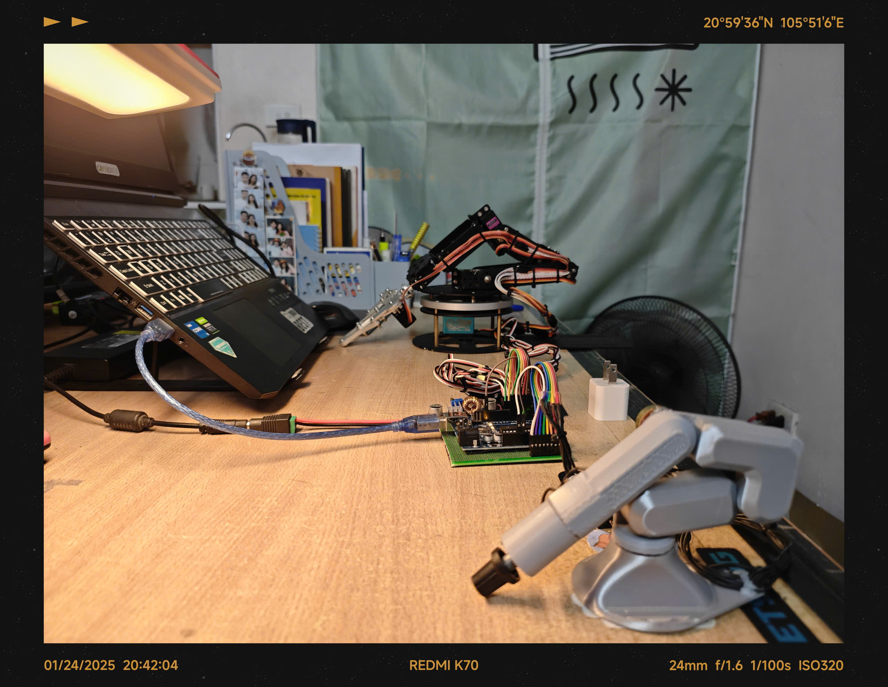
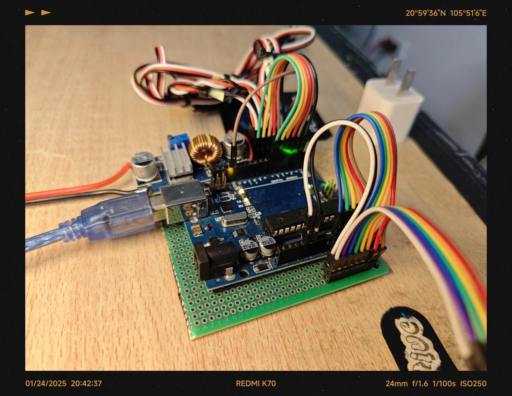

# EduArm - 5-DOF Robot Arm



##  Overview

A 5-DOF robot arm control project using ATmega328P microcontroller with **bare-metal programming** (direct register manipulation). The system features an innovative control method using a miniature replica of the robot arm equipped with potentiometers at each joint to measure rotation angles, which then drives the full-scale robot arm to mimic the corresponding movements in real-time.

---

##  Key Features

-  **5 Degrees of Freedom** - Control 6 independent servo motors
-  **Intuitive Control** - Physical miniature model with potentiometers at each joint
-  **Bare Metal Programming** - Low-level programming on ATmega328P with direct register manipulation
-  **Dual Implementation** - Both bare-metal and high-level (Arduino) versions available
-  **Timer Interrupt Driven** - Uses Timer1 CTC mode for precise PWM signal generation
-  **High ADC Precision** - Reads 6 ADC channels from potentiometers with 10-bit resolution

---

## 🎬 Demo

[](https://www.youtube.com/watch?v=x8GzVEdLkVo)

📹 **[Watch Full Demo on YouTube](https://www.youtube.com/watch?v=x8GzVEdLkVo)**

---

##  Product Images

<table>
  <tr>
    <td></td>
    <td></td>
  </tr>
  <tr>
    <td align="center"><b>Main Robot Arm</b></td>
    <td align="center"><b>Miniature Controller</b></td>
  </tr>
  <tr>
    <td></td>
    <td></td>
  </tr>
  <tr>
    <td align="center"><b>Complete System</b></td>
    <td align="center"><b>Control Circuit</b></td>
  </tr>
</table>

---

##  Hardware

### Main Components

- **Microcontroller:** ATmega328P (Arduino Uno/Nano)
- **Servo Motors:** 6x Servo (MG996R or equivalent)
- **Potentiometers:** 6x 10kΩ
- **Power Supply:** 5-6V (separate for servos)

### Connection Diagram

#### Servo Motors
| Servo | Pin | Description |
|-------|-----|-------------|
| S0 | D2 | Base rotation |
| S1 | D3 | Shoulder |
| S2 | D4 | Elbow |
| S3 | D5 | Wrist |
| S4 | D6 | Wrist rotation |
| S5 | D7 | Gripper |

#### Potentiometers (Analog Input)
| Potentiometer | Pin | Corresponding Joint |
|---------------|-----|---------------------|
| POT0 | A0 | Base |
| POT1 | A1 | Shoulder |
| POT2 | A2 | Elbow |
| POT3 | A3 | Wrist |
| POT4 | A4 | Wrist rotation |
| POT5 | A5 | Gripper |

---

##  Software

### Project Structure

```
EduArm/
 EduArm_Bare_Metal_Programming.ino
 EduArm_High_Level_Programming.ino
 images/
    banner.jpg
    robot_arm.jpg
    mini_controller.jpg
    full_system.jpg
    circuit.jpg
 README.md
```

### 1. Bare Metal Programming

This version uses low-level programming with the following features:

- **Timer1 CTC Mode**: Generates PWM signals for 6 servos with 20ms period
- **Interrupt Service Routine (ISR)**: Implements state machine to control each servo
- **ADC Manual Configuration**: Configures and reads ADC through direct register manipulation
- **Direct Register Manipulation**: No Arduino libraries used

#### Working Principle

```cpp
// Timer1 CTC mode with prescaler = 8
// OCR1A determines interrupt timing
// State machine toggles between ON/OFF states for each servo
ISR(TIMER1_COMPA_vect) {
    // Toggle servo state
    // Update OCR1A for next interrupt
}
```

**Technical Specifications:**
- CPU Frequency: 16MHz
- Prescaler: 8 (Timer ticks every 0.5μs)
- PWM Period: ~20ms (50Hz)
- Pulse Width: 460μs - 2520μs (servo dependent)

### 2. High-Level Programming

Simplified version using Arduino's Servo library:

- **Servo Library**: Uses ```Servo.h``` for control
- **analogRead()**: Reads potentiometer values
- **map()**: Converts ADC values to microseconds
- **Easier to understand and maintain**

---

##  Installation & Usage

### Requirements

- Arduino IDE 1.8+ or PlatformIO
- Board: Arduino Uno/Nano (ATmega328P)
- Libraries: Servo (only for high-level version)

### Instructions

1. **Clone repository:**
```bash
git clone https://github.com/nguyenhoainam2707/EduArm.git
cd EduArm
```

2. **Open code file:**
   - Bare-metal: ```EduArm_Bare_Metal_Programming.ino```
   - High-level: ```EduArm_High_Level_Programming.ino```

3. **Calibration:**
   - Measure min/max ADC values for each potentiometer
   - Measure min/max pulse width for each servo
   - Update macros ```MIN_A0```, ```MAX_A0```, ```MIN_S0```, ```MAX_S0```, etc.

4. **Upload code:**
   - Select board: Arduino Uno/Nano
   - Select COM port
   - Upload code

5. **Testing:**
   - Open Serial Monitor (9600 baud)
   - Rotate joints on the miniature model
   - Observe the robot arm moving accordingly

---

##  Applied Knowledge

### Bare-Metal Programming Concepts

1. **Timer/Counter Configuration**
   - CTC Mode (Clear Timer on Compare)
   - Output Compare Register (OCR1A)
   - Timer Interrupts

2. **ADC (Analog-to-Digital Converter)**
   - Reference voltage selection
   - Channel multiplexing
   - Prescaler configuration
   - Conversion timing

3. **Register Manipulation**
   - TCCR1B, TIMSK1 (Timer registers)
   - ADMUX, ADCSRA (ADC registers)
   - DDRD, PORTD (I/O registers)

4. **PWM Signal Generation**
   - Software PWM using interrupts
   - State machine implementation
   - Precise timing control

---

##  Future Work

- [ ] Inverse Kinematics
- [ ] Position memory/playback
- [ ] Bluetooth/WiFi control
- [ ] PC GUI interface
- [ ] Multi-point trajectory planning

---

##  References

- [ATmega328P Datasheet](https://ww1.microchip.com/downloads/en/DeviceDoc/Atmel-7810-Automotive-Microcontrollers-ATmega328P_Datasheet.pdf)
- [Servo Motor Control Theory](https://learn.adafruit.com/adafruit-arduino-lesson-14-servo-motors)
- [AVR Timer Programming](http://ww1.microchip.com/downloads/en/appnotes/doc8453.pdf)

---

##  Author

**Nguyen Hoai Nam**

- GitHub: [@nguyenhoainam2707](https://github.com/nguyenhoainam2707)
- Email: nguyennamyp54@gmail.com

---

##  License

This project is licensed under the MIT License - see the [LICENSE](LICENSE) file for details.

---

##  Acknowledgments

- Thanks to the Arduino and AVR community
- Reference documentation from Microchip/Atmel
- Inspiration from open-source robot arm projects

---

##  Contact

If you have any questions or suggestions, please create an issue or contact me directly!

---

<div align="center">
  
** If you find this project useful, please give it a star! **

Made with ❤️ and passion for robotics!

</div>